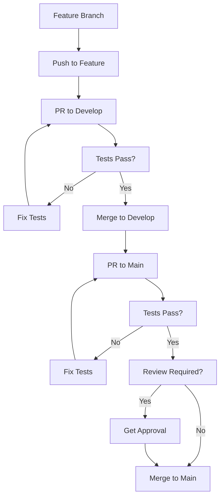

# 🛡️ Configuración de Protección de Ramas

## 📋 Política de Ramas Implementada

### **Rama `main` (Producción)**
- ✅ **Solo PRs desde `develop`** - No se permiten PRs desde otras ramas
- ✅ **Tests unitarios obligatorios** - Todos los PRs deben pasar los tests
- ✅ **No push directo** - Solo merge via PR
- ✅ **Revisión requerida** - Al menos 1 aprobación
- ✅ **No PRs en draft** - Solo PRs completos

### **Rama `develop` (Desarrollo)**
- ✅ **Push directo permitido** - Para desarrollo activo
- ✅ **Tests automáticos** - En cada push
- ✅ **Linting automático** - Verificación de código

### **Ramas `feature/*` (Features)**
- ✅ **Push directo permitido** - Para desarrollo de features
- ✅ **Merge a `develop`** - Via PR con tests

## 🔧 Configuración Automática

### **Workflow de Política de Ramas**
El archivo `.github/workflows/branch-policy.yml` implementa:

1. **Validación de origen de PR**
   - Solo permite PRs a `main` desde `develop`
   - Bloquea PRs desde otras ramas

2. **Bloqueo de push directo**
   - Detecta push directo a `main`
   - Falla el workflow y bloquea el push

3. **Tests unitarios obligatorios**
   - Ejecuta `poetry run pytest tests/` en cada PR
   - Falla si los tests no pasan

4. **Validación de requisitos**
   - Verifica que el PR tenga descripción
   - Bloquea PRs en draft

## 🚀 Cómo Usar la Política

### **Para Desarrolladores:**

#### **1. Desarrollo en feature:**
```bash
# Crear feature branch
git checkout -b feature/nueva-funcionalidad

# Hacer cambios y commits
git add .
git commit -m "feat: agregar nueva funcionalidad"

# Push a feature branch
git push origin feature/nueva-funcionalidad
```

#### **2. Merge a develop:**
```bash
# Crear PR desde feature a develop
# GitHub automáticamente ejecutará tests
# Merge cuando los tests pasen
```

#### **3. Release a main:**
```bash
# Crear PR desde develop a main
# Los tests unitarios se ejecutarán automáticamente
# Solo se puede mergear si los tests pasan
```

### **Para Administradores:**

#### **Configurar Protección de Rama en GitHub:**
1. Ve a **Settings** → **Branches**
2. Haz clic en **Add rule** para `main`
3. Configura:
   - ✅ **Require a pull request before merging**
   - ✅ **Require status checks to pass before merging**
   - ✅ **Require branches to be up to date before merging**
   - ✅ **Require review from code owners**
   - ✅ **Restrict pushes that create files**
   - ✅ **Require linear history**

## 🧪 Tests Unitarios

### **Ejecución Automática:**
- **En cada PR** a `main` desde `develop`
- **Comando**: `poetry run pytest tests/ -v --tb=short`
- **Resultado**: PR bloqueado si tests fallan

### **Ejecución Manual:**
```bash
# Instalar dependencias
poetry install --with dev

# Ejecutar tests
poetry run pytest tests/ -v

# Ejecutar tests con cobertura
poetry run pytest tests/ --cov=hyblock_capital_sdk
```

## 📊 Monitoreo

### **Logs del Workflow:**
- **GitHub Actions** → **Branch Policy** → **View logs**
- **Verificar** que los tests pasen
- **Revisar** mensajes de política

### **Métricas:**
- **PRs bloqueados** por política
- **Tests fallidos** en PRs
- **Tiempo de ejecución** de tests

## 🚨 Troubleshooting

### **Error: "Push directo a main no permitido"**
```bash
# Solución: Usar PR desde develop
git checkout develop
git push origin develop
# Crear PR en GitHub desde develop a main
```

### **Error: "Solo se permiten PRs a main desde develop"**
```bash
# Solución: Cambiar base del PR
# En GitHub: Edit PR → Change base to develop
```

### **Error: "Tests unitarios fallaron"**
```bash
# Solución: Arreglar tests localmente
poetry run pytest tests/ -v
# Hacer commit de fixes
git add .
git commit -m "fix: arreglar tests unitarios"
git push origin develop
```

## 🔄 Flujo de Trabajo Completo



## 📚 Referencias

- [GitHub Branch Protection](https://docs.github.com/en/repositories/configuring-branches-and-merges-in-your-repository/defining-the-mergeability-of-pull-requests/about-protected-branches)
- [GitHub Actions](https://docs.github.com/en/actions)
- [Poetry Testing](https://python-poetry.org/docs/cli/#test)
