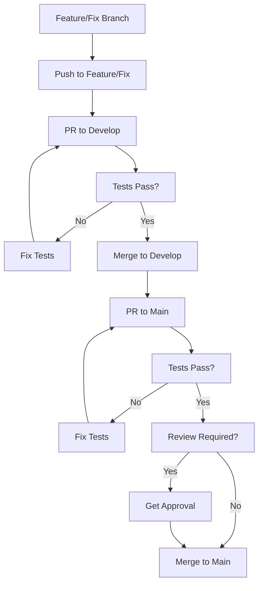

# 🛡️ Configuración de Protección de Ramas

## 📋 Política de Ramas Implementada

### **Rama `main` (Producción)**
- ✅ **Solo PRs desde `develop`** - No se permiten PRs desde otras ramas
- ✅ **Tests unitarios obligatorios** - Todos los PRs deben pasar los tests
- ✅ **No push directo** - Solo merge via PR
- ✅ **Revisión requerida** - Al menos 1 aprobación
- ✅ **No PRs en draft** - Solo PRs completos
- 🚫 **No creación de ramas** - No se pueden crear ramas desde main

### **Rama `develop` (Desarrollo)**
- 🚫 **No push directo** - Solo PRs desde feature/fix/hotfix
- ✅ **Tests automáticos** - En cada PR
- ✅ **Linting automático** - Verificación de código
- ✅ **Solo PRs desde feature/*, fix/*, hotfix/***
- ✅ **Base para nuevas ramas** - Todas las ramas deben crearse desde develop
- ✅ **Única fuente para main** - Solo desde develop se puede hacer PR a main

### **Ramas `feature/*`, `fix/*`, `hotfix/*` (Desarrollo)**
- ✅ **Push directo permitido** - Para desarrollo de features/fixes
- ✅ **Merge a `develop`** - Via PR con tests obligatorios
- ✅ **Tests automáticos** - En cada PR a develop

## 🔄 Flujo de Trabajo Git Flow

### **Flujo Estricto: feature → develop → main**

```
feature/nueva-funcionalidad
    ↓ (PR + Tests)
develop
    ↓ (PR + Tests + Review)
main (producción)
```

### **Reglas de Flujo:**
1. **feature/* → develop**: Solo PRs desde ramas feature/fix/hotfix
2. **develop → main**: Solo PRs desde develop (única fuente)
3. **No saltos**: No se permiten PRs directos de feature/* a main

## 🔧 Configuración Automática

### **Workflow de Política de Ramas**
El archivo `.github/workflows/branch-policy.yml` implementa:

1. **Validación de origen de PR**
   - Solo permite PRs a `main` desde `develop`
   - Solo permite PRs a `develop` desde `feature/*`, `fix/*`, `hotfix/*`
   - Bloquea PRs desde otras ramas

2. **Bloqueo de push directo**
   - Detecta push directo a `main` y `develop`
   - Falla el workflow y bloquea el push

3. **Validación de creación de ramas**
   - Bloquea creación de ramas desde `main`
   - Solo permite ramas creadas desde `develop`
   - Verifica ancestros de las ramas

4. **Tests unitarios obligatorios**
   - Ejecuta `poetry run pytest tests/` en cada PR a `main` o `develop`
   - Falla si los tests no pasan

5. **Validación de requisitos**
   - Verifica que el PR tenga descripción
   - Bloquea PRs en draft

## 🚀 Cómo Usar la Política

### **Para Desarrolladores:**

#### **1. Desarrollo en feature/fix:**
```bash
# IMPORTANTE: Siempre crear ramas desde develop
git checkout develop
git pull origin develop

# Crear feature branch desde develop
git checkout -b feature/nueva-funcionalidad
# O para fixes:
git checkout -b fix/corregir-bug

# Hacer cambios y commits
git add .
git commit -m "feat: agregar nueva funcionalidad"
# O para fixes:
git commit -m "fix: corregir bug en validación"

# Push a feature/fix branch
git push origin feature/nueva-funcionalidad
# O:
git push origin fix/corregir-bug
```

#### **2. Merge a develop:**
```bash
# Crear PR desde feature/fix a develop
# GitHub automáticamente ejecutará tests
# Solo se permite desde feature/*, fix/*, hotfix/*
# Merge cuando los tests pasen
```

#### **3. Release a main:**
```bash
# Crear PR desde develop a main
# Los tests unitarios se ejecutarán automáticamente
# Solo se puede mergear si los tests pasen
```

### **Para Administradores:**

#### **Configurar Protección de Rama en GitHub:**
1. Ve a **Settings** → **Branches**
2. Haz clic en **Add rule** para `main`
3. Configura:
   - ✅ **Require a pull request before merging**
   - ✅ **Require status checks to pass before merging**
   - ✅ **Require branches to be up to date before merging**
   - ✅ **Require review from code owners**
   - ✅ **Restrict pushes that create files**
   - ✅ **Require linear history**

## 🧪 Tests Unitarios

### **Ejecución Automática:**
- **En cada PR** a `main` desde `develop`
- **Comando**: `poetry run pytest tests/ -v --tb=short`
- **Resultado**: PR bloqueado si tests fallan

### **Ejecución Manual:**
```bash
# Instalar dependencias
poetry install --with dev

# Ejecutar tests
poetry run pytest tests/ -v

# Ejecutar tests con cobertura
poetry run pytest tests/ --cov=hyblock_capital_sdk
```

## 📊 Monitoreo

### **Logs del Workflow:**
- **GitHub Actions** → **Branch Policy** → **View logs**
- **Verificar** que los tests pasen
- **Revisar** mensajes de política

### **Métricas:**
- **PRs bloqueados** por política
- **Tests fallidos** en PRs
- **Tiempo de ejecución** de tests

## 🚨 Troubleshooting

### **Error: "Push directo a main/develop no permitido"**
```bash
# Solución: Usar PR desde feature/fix
git checkout develop
git checkout -b feature/tu-cambio
git push origin feature/tu-cambio
# Crear PR en GitHub desde feature/tu-cambio a develop
```

### **Error: "No se permiten ramas creadas desde main"**
```bash
# Solución: Crear rama desde develop
git checkout develop
git pull origin develop
git checkout -b feature/tu-cambio
git push origin feature/tu-cambio
```

### **Error: "Solo se permiten PRs a develop desde feature/*, fix/*, hotfix/*"**
```bash
# Solución: Crear rama con nombre correcto
git checkout -b feature/tu-cambio  # O fix/tu-fix
git push origin feature/tu-cambio
# Crear PR desde la rama correcta
```

### **Error: "Solo se permiten PRs a main desde develop"**
```bash
# Solución: Cambiar base del PR
# En GitHub: Edit PR → Change base to develop
```

### **Error: "Tests unitarios fallaron"**
```bash
# Solución: Arreglar tests localmente
poetry run pytest tests/ -v
# Hacer commit de fixes
git add .
git commit -m "fix: arreglar tests unitarios"
git push origin feature/tu-cambio  # O fix/tu-fix
```

## 🔄 Flujo de Trabajo Completo



## 🧹 Limpieza Automática de Ramas

### Eliminación Automática

El proyecto incluye un workflow automático que elimina las ramas después del merge:

- **Cuándo se activa**: Después de que un PR es mergeado exitosamente
- **Qué ramas se eliminan**: Solo ramas que siguen la convención `feature/*`, `fix/*`, `hotfix/*`
- **Qué ramas se protegen**: `main` y `develop` nunca se eliminan automáticamente

### Workflow de Limpieza

```yaml
# .github/workflows/cleanup-branches.yml
on:
  pull_request:
    types: [closed]

jobs:
  cleanup-branches:
    if: github.event.pull_request.merged == true
    # Elimina automáticamente la rama mergeada
```

### Beneficios

- ✅ **Mantiene el repositorio limpio**
- ✅ **Evita acumulación de ramas obsoletas**
- ✅ **Reduce confusión en el equipo**
- ✅ **Solo elimina ramas que siguen convenciones**

### Excepciones

- **Ramas protegidas**: `main`, `develop`
- **Ramas sin convención**: No se eliminan automáticamente
- **PRs cerrados sin merge**: No se eliminan

## 📚 Referencias

- [GitHub Branch Protection](https://docs.github.com/en/repositories/configuring-branches-and-merges-in-your-repository/defining-the-mergeability-of-pull-requests/about-protected-branches)
- [GitHub Actions](https://docs.github.com/en/actions)
- [Poetry Testing](https://python-poetry.org/docs/cli/#test)
